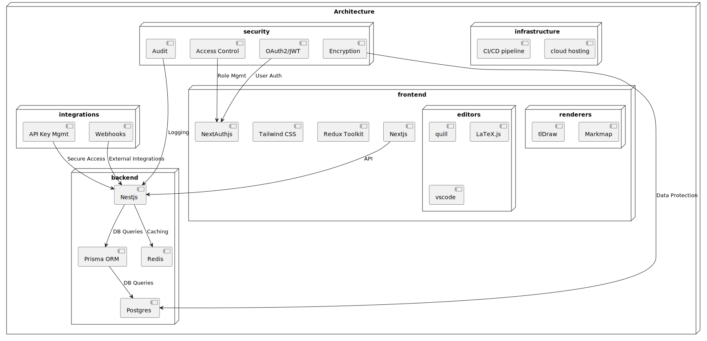
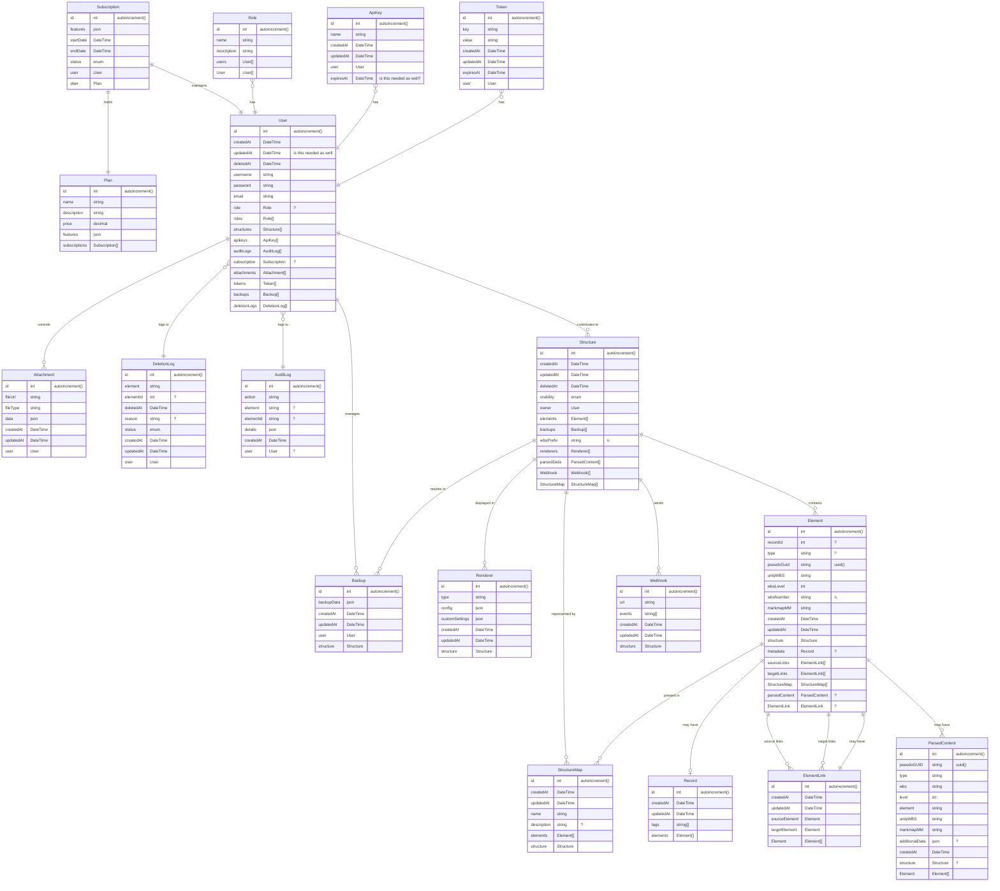

### Copyright Notice

© 2024 Paul Galjan. All rights reserved. This project and its contents, including any designs, specifications, and associated materials, are protected by copyright law. Unauthorized use, reproduction, or distribution of this document or any part of its contents is prohibited without the express written permission of Paul Galjan.

### Legal Use and Restrictions

This document is intended solely for personal use and may not be shared, reproduced, or modified without prior written consent. Violators may be subject to legal action.

# Overview
Atlas is a conceptual multi-user structure visualization and annotation platform featuring a modular interactive renderer that allows the user to create or calculate multiple structured or unstructured views of a shared dataset (represented as "Elements" and "Records" in the object model). These views can be shared with others, and the same data may be represented in different views while maintaining consistency.

The front-end is paired with a simple, flexible and scalable multi-user key/value store for user annotation of the data, along with subsequent reporting.

The same data set can be leveraged in multiple structures, leaving the user free to create multiple structures of the same library. The links between each element in the renderer can carry its own attributes, allowing for dynamic re-representation, aggregation, and summarization of data based on the rendered view.  This allows visual and quantitative comparison based on the relationships defined by the user in the renderer. 

###### example implementation

# Use Cases

* **Strategy teams** can collaborate to quickly generate, iterate, assess, and compare business plan and proposal assets.
* **Analysts** can construct reports across structures for comparative and historical analysis.
* **Generative AI Consumers** can structure GenAI output for human curation, research, and annotation
* **Instructors** can distribute syllabus and other assets, and gather assets from **learners**, who can leverage it for structured notetaking aligning to a learning plan or independent course of study
* **Content Managers** can re-imagine legacy record interfaces, constructing persona-aligned navigation experiences
* **Buy-side planners** can collect and report on assets from vendors, suppliers and distributors.
* **Consultants** can create flexible, semi-structured data sets and no-code UIs for comparative analysis.
* **UX Designers** can create user-friendly rhizomatic data collection patterns, with progressive detail exposure.

# Architecture

## Object Model

Each `Structure User` can create, read, update, delete, and share `Structures`, which represent an idea acted on by an individual or group of people.  In an educational setting, this could be a class syllabus or group project, in an academic setting this might represent a field of research or domain specialty, in a corporate setting it could represent a business proposal.

Structures are comprised of `Elements`.  Each Element is associated with a single uniquely identitified `Record`.  Each Record can contain data of any type as defined by the Structure Owner(s).  Additionally, the Structure Owner can define and allow `Element Type`, which can be associated to record types, and leveraged in downstream analysis.

Elements are represented on one or more `Structure Maps`, which are graphical representations of the elements on an infinite scroll 2D canvas.  Elements may be connected to other Elements in the Structure Map via zero or more `Element Links`, which are also associated with a single uniquely identified Record, the attributes of which are separately defined by the Structure Owner.  Structure Maps may also be linked to Elements residing in external Structures via `Structure Links`.

Structure Users are also mapped to objects required for IAM, billing, and feature flagging as typically required in a multi-user SaaS delivery model.

## Data Model

## User Roles

* **Structure Owner**: Add Collaborators, Structure and Structure Link CRUD, Export Structure
* **Structure Editor**: Edit Structure Map and Records
* **Structure Commenter**:  Browse and comment on structure map and records
* **Structure Viewer**: Browse structure map and records
* **Instance Admininstrator**:  Instance CRUD, Structure Owner CRUD 
  
## Reference and Mock Data Sets

### Kickstarter

Create a structure in excel, preview its WBS numbering, and import it into the Atlas platform

[Download](./AtlasKickstarter.xlsx)

### Example Structures

Example structures for business, engineering, project management and educational use cases

[Download](./unitTestData/element/structureLibrary.csv)

| type                   | dataset                     |
|------------------------|-----------------------------|
| Personal              | [Vacation Plans](https://atlasstructure.tiiny.site/vacation.html) |
| Personal              | [Film Library](https://atlasstructure.tiiny.site/film.html) |
| Education              | [Human Languages](https://atlasstructure.tiiny.site/languages.html)             |
| Education              | [Human Brain](https://atlasstructure.tiiny.site/brain.html) |
| Education              | [French Revolution](https://atlasstructure.tiiny.site/frenchrev.html) |
| Business               | [Product Breakdown Structure](https://atlasstructure.tiiny.site/autonomous.html)        |
| Business               | [Insurance Sales Plan](https://atlasstructure.tiiny.site/insurance.html)        |
| Business               | [Design/Build Project](https://atlasstructure.tiiny.site/designbuild.html)        |
| Business               | [Marketing Plan](https://atlasstructure.tiiny.site/marketing.html)        |
| Business               | [Process Improvement](https://atlasstructure.tiiny.site/processimprove.html)         |
| Business               | [Outsourcing Project](https://atlasstructure.tiiny.site/outsource.html)         |
| Business               | [Software Development](https://atlasstructure.tiiny.site/softwaredev.html)        |
| Business               | [Telecom](https://atlasstructure.tiiny.site/telecom.html)                    |
| Business               | [Web Design](https://atlasstructure.tiiny.site/webdesign.html)                  |
| Construction           | [Environmental Remediation](https://atlasstructure.tiiny.site/envmgmt.html)   |
| Construction           | [Factory Construction](https://atlasstructure.tiiny.site/processplant.html)        |
| Construction               | [Production Platform](https://atlasstructure.tiiny.site/prodplatform.html)         |
| Medical              | [Patient Medical Record](https://atlasstructure.tiiny.site/pmr.html)                  |
| Research & Development | [Research Project](https://atlasstructure.tiiny.site/research.html)            |
| Research & Development | [New Compound](https://atlasstructure.tiiny.site/compound.html)                |
| MIL-STD-811F           | [Aircraft System](https://atlasstructure.tiiny.site/aircraft.html)             |
| MIL-STD-811F           | [Electronics/Avionics](https://atlasstructure.tiiny.site/avionics.html)        |
| MIL-STD-811F           | [Missile/Ordnance](https://atlasstructure.tiiny.site/ordnance.html)            |
| MIL-STD-811F           | [Strategic Missile System](https://atlasstructure.tiiny.site/sms.html)    |
| MIL-STD-811F           | [Sea System](https://atlasstructure.tiiny.site/seasystem.html)                  |
| MIL-STD-811F           | [Space System](https://atlasstructure.tiiny.site/spacesystem.html)                |
| MIL-STD-811F           | [Ground Vehicle](https://atlasstructure.tiiny.site/groundvehicle.html)              |
| MIL-STD-811F           | [Unmanned Maritime System](https://atlasstructure.tiiny.site/unmannedmaritime.html)    |
| MIL-STD-811F           | [Launch Vehicle](https://atlasstructure.tiiny.site/launchvehicle.html)              |
| MIL-STD-811F           | [Information/Business System](https://atlasstructure.tiiny.site/infosys.html) |
| MIL-STD-811F           | [Sustainment](https://atlasstructure.tiiny.site/sustainment.html)                 |
| Platform Test          | [Bicycle](https://atlasstructure.tiiny.site/bicycle.html)                     |
| Platform Test          | [Bicycle for UI Sim](https://atlasstructure.tiiny.site/bicyclesim.html)          |
| Platform Test          | [Depth Gauge](https://atlasstructure.tiiny.site/depthGauge.html)                 |
| Platform Test          | [Width Gauge](https://atlasstructure.tiiny.site/widthGauge.html)                 |

## Editions

🅿️ - Prototype Feature

|   | Personal | Educator | Analyst | Business |
| -----: | :-----: | :-----: | :-----: | :-----: |
| price | free | $ | $$ | $$$|
| Structures🅿️ | 5 | 50 | unlimited | unlimited |
| Collaborators |  | 500 | unlimited | unlimited |
| Storage & Transfer* | 100 MiB | 1 GiB | 10 GiB | 100 GiB | 
| Visual structure map🅿️ | ✅ | ✅ | ✅ | ✅ | 
| Passwordless login   | ✅ | ✅ | ✅ | ✅ |
| Rich Text Annotation🅿️ | ✅ | ✅ | ✅ | ✅ |
| Import from Excel🅿️  | ✅ | ✅ | ✅ | ✅ |
| Export to html, md🅿️ | ✅ | ✅ | ✅ | ✅ |
|**Document Editing**   |
| Math Typesetting ([LaTeX](https://latex.js.org/playground.html))|  | ✅ | ✅ | ✅ |
| File/Image Hosting |  |  | ✅ | ✅ |
| AI Assistant |  |  | ✅ | ✅ |
| Full Document Formatting |  |  | ✅ | ✅ | 
|**Structure Management**   |
| Structure Backup/Restore🅿️ |  | ✅ | ✅ | ✅ |
| Structure marketplace |  | ✅ | ✅ | ✅ |
| Custom Records  |  |  | ✅ | ✅ |
| Object Tagging |  |  | ✅ | ✅ |
| Element-level export |  |  | ✅ | ✅ |
| Export to docx, pdf, pptx |  |  | ✅ | ✅ |
| Structure-level Attributes |  |  | ✅ | ✅ |
| Custom Views |  |  | ✅ | ✅ | 
| Snapshots |  |  | ✅ | ✅ |
| Cross-structure reporting |  |  | ✅ | ✅ |
| Structure differencing |  |  | ✅ | ✅ |
|**Collaboration**   |
| Report Sharing |  |  | ✅ | ✅ |
| View Sharing |  |  |  | ✅ |
| Embed codes |  |  |  | ✅ |
| Strict Record Formatting |  |  |  | ✅ | 
| @Mentions and Comments |  |  |  | ✅ |
| Tasks and Planner |  |  |  | ✅ |
| Survey Module |  |  |  | ✅ |
| Dynamic WBS🅿️ |  |  |  | ✅ |
| Proposal Builder |  |  |  | ✅ |
| Custom Template |  |  |  | ✅ |
| Custom Tooltips |  |  |  | ✅ |
| Structure linking |  |  |  | ✅ |
| MIL-STD-811F templates |  |  |  | ✅ |
|**Platform Management &  Interoperability**   |
| Single Sign-On |  |  |  | ✅ |
| Webhooks |  |  |  | ✅ |
| API Access |  |  |  | ✅ |

*Additional Storage and Transfer $0.10/GiB-Month