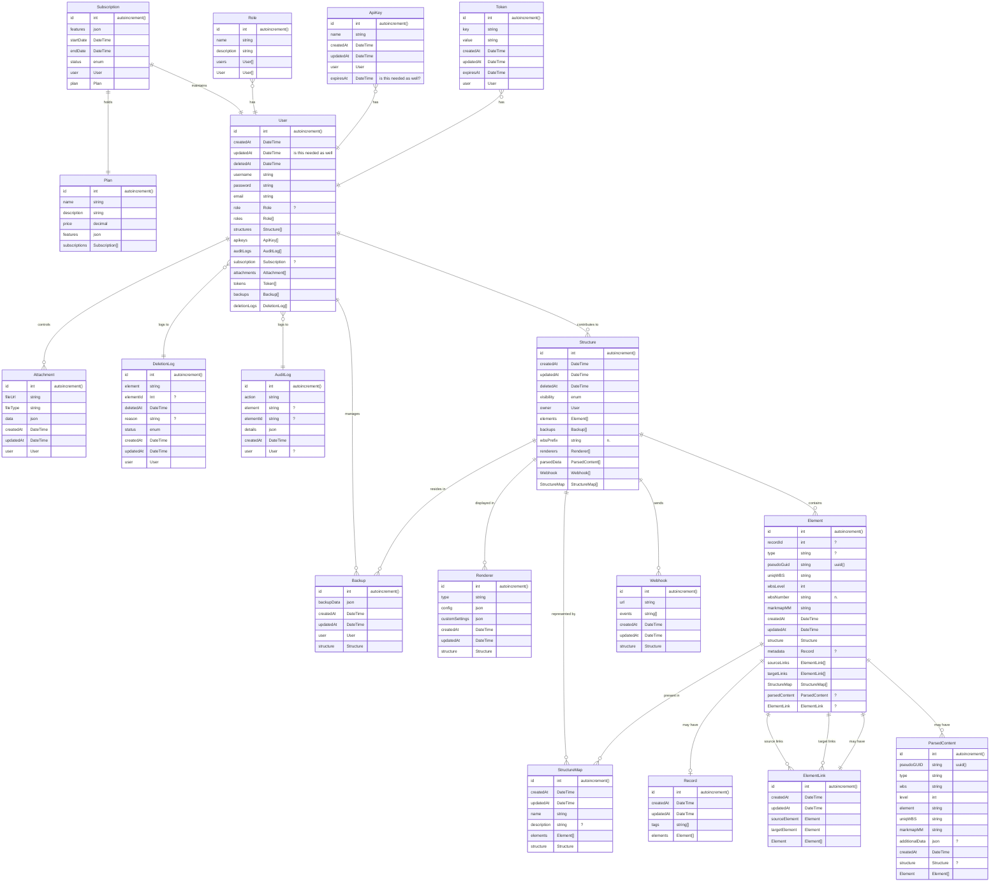
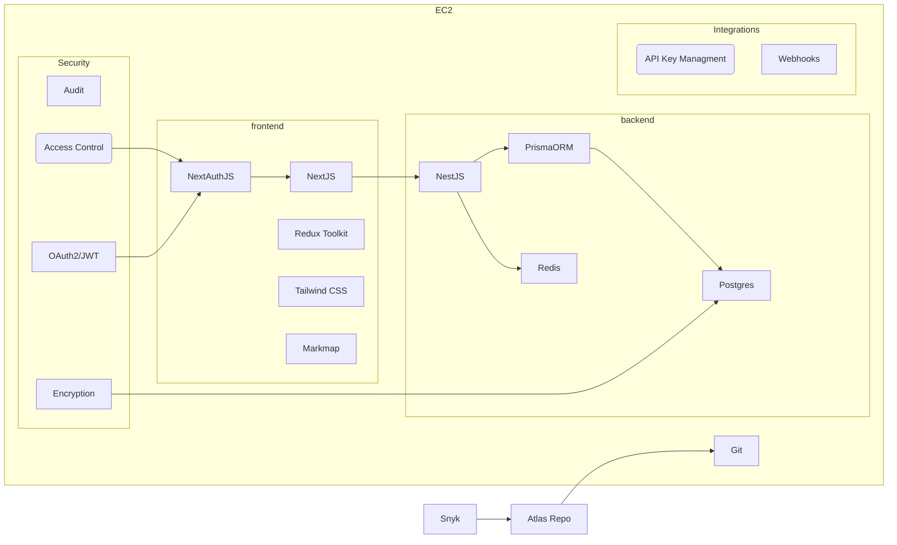

## Object Model

Each `Structure User` can create, read, update, delete, and share `Structures`, which represent an idea acted on by an individual or group of people.  In an educational setting, this could be a class syllabus or group project, in an academic setting this might represent a field of research or domain specialty, in a corporate setting it could represent a business proposal.

Structures are comprised of `Elements`.  Each Element is associated with a single uniquely identitified `Record`.  Each Record can contain data of any type as defined by the Structure Owner(s).  Additionally, the Structure Owner can define and allow `Element Type`, which can be associated to record types, and leveraged in downstream analysis.

Elements are represented on one or more `Structure Maps`, which are graphical representations of the elements on an infinite scroll 2D canvas.  Elements may be connected to other Elements in the Structure Map via zero or more `Element Links`, which are also associated with a single uniquely identified Record, the attributes of which are separately defined by the Structure Owner.  Structure Maps may also be linked to Elements residing in external Structures via `Structure Links`.

Structure Users are also mapped to objects required for IAM, billing, and feature flagging as typically required in a multi-user SaaS delivery model.

## Data Model

# Architecture

