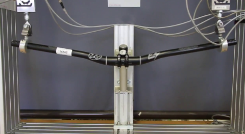

| Key                       | Value                                       |
| ------------------------: | ------------------------------------------- |
| name                      | Component Test RFP                          |
| type                      | Element                                     |

# Description

The component test during bicycle development evaluates the individual parts of the bicycle to ensure they meet **performance**, **durability**, and **safety standards** before being integrated into the final product. This process ensures each component functions reliably under anticipated conditions, reducing the risk of failures and optimizing overall [product quality](https://www.nist.gov/nist-quality-system).


1. Verification of Component Performance
- Strength Testing: Assess components such as the frame, fork, and wheels to ensure they can handle stress and loads without deforming or breaking.
- Functional Validation: Test the functionality of components like brakes, gears, and suspension systems to confirm they operate smoothly and effectively.
- Performance Metrics: Measure specific properties, such as the rolling resistance of tires, braking force, or gear-shifting precision.
2. Durability and Fatigue Testing
- Repeated Load Tests: Simulate long-term use by applying cyclic loads to components to evaluate their durability over time.
- Impact Resistance: Test the ability of parts like rims and handlebars to withstand sudden impacts, such as hitting potholes or obstacles.
- Environmental Testing: Assess the resistance of materials to environmental factors, such as corrosion, UV exposure, and extreme temperatures.
3. Safety Assurance
- Regulatory Compliance: Ensure components meet safety standards, such as ISO 4210, for critical systems like brakes and frames.
- Failure Testing: Push components beyond normal use limits to identify potential failure points and improve design robustness.
4. Compatibility Testing
- System Integration: Verify that components work seamlessly with each other, such as ensuring a derailleur aligns correctly with the drivetrain or a fork fits the frame without issues.
- Manufacturing Tolerances: Test for consistency and precision in components to avoid mismatches during assembly.
5. Quality Control
- Batch Testing: Evaluate sample components from production batches to maintain consistent quality.
- Defect Identification: Detect issues such as misalignments, material weaknesses, or production flaws before mass production.
6. Innovation and Optimization
- Material Testing: Experiment with new materials or designs for components to enhance performance or reduce weight.
- Feature Testing: Evaluate additional features like quick-release mechanisms, hydraulic brakes, or smart sensors for functionality and user convenience.

## Key Deliverables
- Comprehensive test reports with performance metrics and failure analysis.
- Recommendations for design improvements or material changes.
- Certification of components as ready for integration into the final product.

## Value of Component Testing
Component testing ensures each part of the bicycle is reliable, safe, and optimized for performance before assembly. By addressing issues at the component level, it minimizes the risk of costly failures later in the development process and contributes to a high-quality, durable product that meets customer expectations.


# Links

| Key                       | Value                |
| ------------------------: | -------------------- |
|  NIST Handbook 133 4th Ed.                         |  [link](https://view.officeapps.live.com/op/view.aspx?src=https%3A%2F%2Fwww.nist.gov%2Fsystem%2Ffiles%2Fdocuments%2F2017%2F05%2F09%2FHandbook-133-2003.doc&wdOrigin=BROWSELINK)                    |

# Tags

| Key                       | Value                |
| ------------------------: | -------------------- |
|  location              |     Springfield                 |
| division | quality |


# SystemAttributes

| Key                       | Value                                       |
| ------------------------: | ------------------------------------------- |
| guid                      | ```054c5638-61a8-7530-789c-aeb3b73e746d```  |
| created                   |   45621.70857                               |
| updated                   |   45623.59488                               |
| createdBy                 | ```054c5639-1a55-7531-232a-17d9c2348cd0```  |
| updatedBy                 | ```054c5639-c3c9-7531-5ff7-d8ffc2ac7e07```  |
| owner                     | ```054c5639-1a55-7531-232a-17d9c2348cd0```  |
| contributor               | ```054c5639-c3c9-7531-5ff7-d8ffc2ac7e07```  |
| contributor               | ```054c5639-2829-7531-7254-a230ebe29e1c```  |
| viewer                    | ```054c5639-beb2-7531-fc1b-6dcecec9bf58```  |
| viewer                    | ```054c5639-1582-7531-2092-608df41cb598```  |
| viewer                    | ```054c5639-a35e-7531-6cb6-29dc42843542```  |
| viewer                    | ```054c5639-6934-7531-3632-b81c5fca7258```  |

